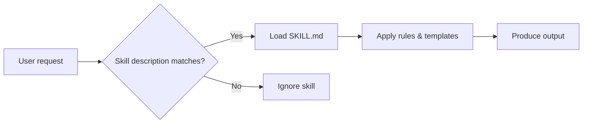

# Example Daily Post — Structure Reference

This is a worked example showing the expected shape of a daily AI blog. Do **not** copy the prose verbatim. It exists to show length, rhythm, headline style, and where visuals sit.

---

## Example: "Anthropic ships Claude Skills — why it matters for modellers"

Anthropic this week released a feature called Skills, a way of packaging reusable instructions that Claude loads on demand rather than keeping permanently in context. For anyone using AI in a repeatable workflow — financial modelling included — the change is more practical than it sounds.

A Skill is a small folder containing a `SKILL.md` file plus any supporting scripts or templates. Claude reads the description of each installed Skill, decides whether it applies, and only then loads the full contents. The upshot: specialised guidance without the token cost of always carrying it.

Builders on X have been quick to note the pattern echoes how teams already organise internal documentation (via Simon Willison, @simonw). The Latent Space podcast covered early reactions this week, framing Skills as the first serious attempt at modular context management in a consumer AI product.

### Why it matters for our audience

For financial modellers and Excel practitioners, Skills suggest a pragmatic way to enforce house style, audit rules, and modelling conventions across a team — without rewriting the same prompt every time. A single "model review Skill" could encode review conventions, banned shortcuts, and preferred formulae, then trigger automatically whenever someone asks Claude to review a workbook.

The trade-off is discipline: poorly-written Skill descriptions either over-trigger or never fire at all. The craft is in the description, not the body.

We will be testing internal Skills for model audit and DAX writing over the coming weeks and reporting back.

### Sources

- Anthropic announcement (paraphrased)
- @simonw on X (paraphrased)
- Latent Space podcast, weekly digest (paraphrased)

---

## Notes on the example

- **Headline**: factual, names the thing, names the audience benefit.
- **Opening**: one sentence on what happened, one on why it matters.
- **Body**: three short paragraphs. Each paragraph is one idea.
- **Image**: placed after the core explanation but before the audience angle.
- **Flow chart**: placed inside the audience-angle section, where it illustrates the decision flow.
- **Closing**: forward-looking, signals our own follow-up.
- **Sources**: bulleted, paraphrased attributions — never verbatim quotes.
